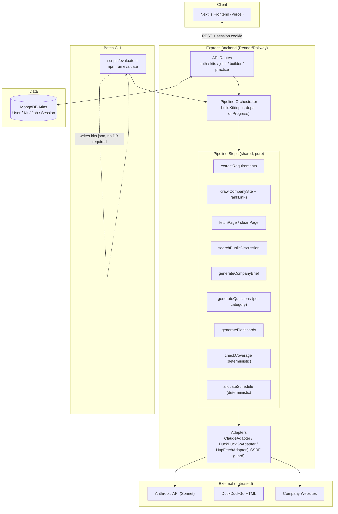
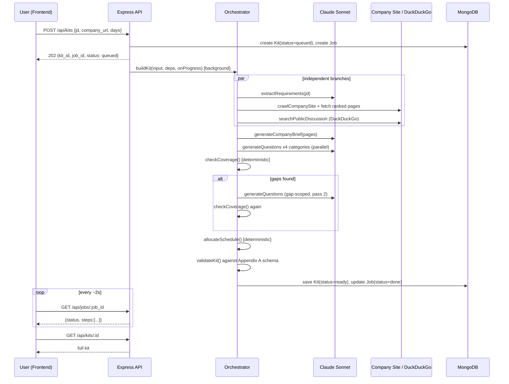

# RFC-001: The AI Interview Prep Kit
Status: DRAFT
Version: v1
Date: 2026-09-10
Experts: Architect, Tech Lead, Design Engineer, Security, QA Strategy

## 1. Problem Statement

Build a full-stack web app (Trao engineering assessment) that turns a pasted job description + a company website URL into a personalised interview prep kit: the system researches the company (crawling for what they do and how they hire, searching for public discussion of their interview process), extracts requirements from the JD, generates categorised questions and flashcards through a multi-step (not single-prompt) LLM pipeline, deterministically checks coverage and closes gaps, deterministically allocates a day-by-day study schedule, and lets the user edit/reorder/regenerate any part without losing their edits. A mandatory `npm run evaluate` batch CLI must run the exact same pipeline non-interactively. Graded 55% automated (run against unseen postings) / 45% human review, deployed publicly on free tiers, 2–3 days of focused work.

## 2. Current State

Greenfield repository — `~/Applications/interview-prep-kit` was `git init`'d with no code, no commits, no existing architecture to audit. This RFC defines the system from scratch rather than describing a migration.

**Locked inputs to this RFC** (developer decisions made before the panel ran):
- Frontend: Next.js + Tailwind CSS. Backend: Node.js + Express. DB: MongoDB. Language: TypeScript.
- LLM: **Anthropic Claude, Sonnet model** (developer has usable API credits — this is why Sonnet was chosen over a free-tier-only provider like Gemini/Groq, despite Anthropic having no standing free tier).
- Public-discussion search: **DuckDuckGo HTML scrape** (no API key required, accepted tradeoff: more brittle than a paid search API).
- Standalone repo, not part of any existing monorepo.
- Developer wants **stage-by-stage implementation review** (RFC → approval → QA plan → approval → implement in reviewable chunks), consistent with the assessment's own integrity note that AI should support planning/implementation/debugging rather than one-shot the entire submission.

**Pre-work required before any code is written** (from Tech Lead):
1. Verify the Anthropic API key has working Sonnet access and remaining credit with a throwaway API call.
2. Create a MongoDB Atlas free (M0) cluster + scoped DB user.
3. Create hosting accounts: Vercel (frontend) + a persistent-process host for the backend (Render/Railway — final pick is an open question, see §10) + confirm Atlas network access.
4. Build a local static fixture "company site" (mirrors the `http://localhost:8099/acme/` shape from Appendix B) to develop and test the crawler without hitting real sites or requiring network access in CI.
5. Sanity-check that a plain HTTP GET against DuckDuckGo's HTML endpoint returns parseable, non-blocked results.

## 3. Proposed Design

### 3.1 System Components

- **Next.js frontend** (Vercel) — auth pages, kit list, the Builder (editor UI), Practice Mode, batch-upload UI.
- **Express backend** (Render/Railway, persistent process — deliberately *not* Vercel serverless functions, since generation runs 90s+ across multiple LLM calls and needs in-process job/progress tracking that a stateless function invocation model fights against) — auth, kit CRUD, job-status polling, builder mutation endpoints, practice endpoints.
- **Pipeline / orchestration layer** — a pure, framework-agnostic module (`buildKit(input, deps, onProgress)`) with zero knowledge of Express, Mongo, or the CLI's file I/O. This is the single most important architectural decision in the RFC: **both** the Express `/generate` route and the `npm run evaluate` batch CLI call this exact function, satisfying Section 9's explicit requirement that the batch command "run your full retrieval, generation and validation path... the same code your application uses, not a parallel implementation."
- **Adapters** behind interfaces (`LlmAdapter`, `SearchAdapter`, `FetchAdapter`) — concrete implementations `ClaudeAdapter`, `DuckDuckGoAdapter`, `HttpFetchAdapter` (the last wrapping the SSRF guard). Swappable, and critically, fakeable in tests with zero network calls.
- **MongoDB** — `User`, `Kit` (embeds questions/flashcards/schedule — see §6), `Job` (generation status, separate collection), `Session` (server-side session store).
- **`scripts/evaluate.ts`** — thin CLI wrapper: parse args → read `cases.json` → run `buildKit` per case through a bounded concurrency pool → write `kits.json` in the Appendix B shape.
- **External services**: Anthropic API (Sonnet), DuckDuckGo HTML search, arbitrary company websites (untrusted).

### 3.2 Pipeline Step Sequence (Section 3 of the assessment, graded 10 pts on "genuine sequencing")

Ten step modules under `backend/src/pipeline/steps/`, composed by an `orchestrator.ts`:

1. **`extractRequirements(jd)`** — LLM call. No retrieval needed (pasted text only) — runs immediately, in parallel with steps 2–4.
2. **`fetchPage(url)`** — single-URL fetch + boilerplate-stripped clean text. Reused by both company crawling and discussion-search result retrieval.
3. **`crawlCompanySite(companyUrl)`** — BFS traversal from the homepage collecting candidate links. **No fixed path list** — genuinely follows the site's own structure.
4. **`rankLinks(candidateLinks)`** — deterministic heuristic scoring (anchor text/path keywords: careers, jobs, hiring, culture, engineering, handbook; nav vs. footer position) to decide what's worth fetching. Pure function, unit-testable against fixtures independent of live network.
5. **`generateCompanyBrief(fetchedPages)`** — LLM call, only runs once steps 2–4 have produced content.
6. **`searchPublicDiscussion(companyName)`** — DuckDuckGo scrape → top-N candidate URLs → `fetchPage`/clean each.
7. **`generateQuestions(requirement, category)`** — LLM call **per category** (technical / behavioural / system-design / company-fit), each with its own prompt and its own subset of requirements by `kind`. This is the literal implementation of the spec's "a requirement like 5 years React should not come from the same call as mentoring juniors."
8. **`generateFlashcards(questions)`** — LLM call, derived from already-generated questions so flashcards stay consistent with the question bank.
9. **`checkCoverage(requirements, questions)`** — **deterministic, no LLM** — requirement ids vs. `question.requirement_ids`.
10. **`allocateSchedule(topics, daysAvailable)`** — **deterministic, no LLM** — priority-sorted arithmetic allocation across exactly the requested days.

**The coverage loop** (Section 4) sits at the orchestration level, not inside a step: run 9 → if `uncovered_requirement_ids` is non-empty, re-run step 7 scoped *only* to the gap requirement/category pairs → re-run 9 → stop. **Capped at 2 passes by default** (first draft + one gap-fill), consistent across Architect/QA recommendations, with the cap being a named constant — a requirement still uncovered after the cap is shipped honestly in `coverage.uncovered_requirement_ids`, never silently dropped or fabricated around.

Steps 1 and 2–4/6 fan out concurrently (`Promise.all`); steps 5, 7, 8 fan in once their dependencies resolve; the four category-7 calls run concurrently with each other. This fan-out/fan-in shape — not step count — is what makes the pipeline "respond to what was actually found" per the spec's own framing.

### 3.3 Non-Destructive Regeneration — the "hardest state problem" (Section 6)

Every question/flashcard/brief-field/schedule item carries a `_meta` block:
```ts
_meta: {
  source: "generated" | "edited" | "user_added",
  pinned: boolean,
  order: number,           // float-spaced (1000, 2000, ...) so reorder never renumbers siblings
  generatedAt: string | null,
  editedAt: string | null,
  generationBatch: string  // job id that produced/last touched this item
}
```
`source` and `pinned` are **independent** — a user can pin a generated item they like without editing it, and it must survive regeneration exactly like a hand-edit does.

**Section-scoped regeneration merge algorithm** (`POST /kits/:id/regenerate { section }`):
1. Re-run the relevant generation step(s) fresh (same function as initial generation) → candidate items, no ids assigned yet.
2. Partition existing items in that section: `keep = source !== "generated" || pinned`, `discard = everything else`.
3. Assign candidates new ids (`max existing numeric suffix + 1, +2, ...` — no collisions with kept items).
4. Run `checkCoverage` over `keep + candidates` to trim redundant candidates before merging.
5. Write `keep + trimmedCandidates` back; prune any now-dangling `schedule.question_ids` referencing discarded items (schedule itself is only rebuilt if the user explicitly regenerates the schedule section — a category regen doesn't silently reflow it).
6. `keep` items retain their existing `order`; new items append after the max.

This is the mechanism, not just the intent, behind "a question the user wrote or edited by hand must survive a regeneration of its category" — enforced server-side on every regenerate call, never trusted from the client.

### 3.4 Async Generation, Not Blocking Request/Response

`POST /kits` returns `202` immediately with `{ kit_id, job_id, status: "queued" }`; the Kit document exists right away (so it appears in the list view in a "generating" state — satisfying Section 12's loading-state requirement) while `buildKit` runs as a background task, checkpointing progress per step into a `Job` document polled by the frontend every ~2s (`GET /api/jobs/:job_id`). This is required because generation is 90s+ (Section 13) — holding one HTTP connection open that long is fragile against free-tier host/proxy timeouts, and "visible progress" needs genuine step-level events, not a single opaque spinner. Per-step checkpointing is also the direct answer to Section 13's "what happens if generation fails halfway": the Job record shows exactly which step it died on.

## 4. Comparison — Requirement → Design Decision

| Dimension | Decision | Rationale |
|---|---|---|
| Repo structure | Single repo, pnpm workspaces (`backend`, `frontend`, `shared`), independently deployed | One shared `shared/schema/kit.ts` (Appendix A as zod) prevents FE/BE/CLI schema drift; splitting repos wouldn't even divide the pipeline, since both Express and the CLI run in the same Node backend |
| Kit generation model | Async job + polling (202 + job id), not blocking request | 90s+ multi-call generation; free-tier host connection timeouts; need genuine step-level progress |
| Persistence of questions/flashcards | Embedded in the Kit document, not referenced collections | Always read/written as one bounded aggregate; embedding makes the regeneration-merge a single atomic document write |
| Job/progress tracking | Separate `Job` collection, TTL-expired | Different write pattern (many small ticks over 90s) from Kit edits — colocating would create write contention on the same document the Builder is concurrently editing |
| Generated/edited/pinned state | Per-item `_meta.source` + independent `_meta.pinned` boolean | Two orthogonal reasons an item is protected from regeneration; folding them into one enum loses the "pinned-but-not-edited" case |
| Session handling | Server-side session store in Mongo (opaque token, httpOnly/Secure/SameSite=None cookie), not JWT | Free instant revocation; Section 1's "sensible handling of expired/invalid sessions" is a native TTL-index behavior, not something to reimplement |
| Hiring-page discovery | Real crawl + deterministic link-ranking heuristic, not a fixed path list | Spec states outright a fixed list is insufficient; ranking is cheap pattern-matching, doesn't need LLM reasoning |
| Coverage checking & schedule allocation | Plain deterministic code, not LLM calls | Explicit spec requirement (Section 3); also what makes these two the easiest, most valuable things to unit-test (Section 14) |
| Deployment split | Frontend: Vercel. Backend: Render or Railway (persistent process) | Vercel serverless functions' execution-time caps are hostile to a 90+ second pipeline; a long-running process is the natural fit for background job execution |

## 5. Architecture Diagram





## 6. API & Data Model Changes

### 6.1 Key REST Endpoints

```
POST   /api/auth/register | /login | /logout    GET /api/auth/session
POST   /api/kits            {jd, company_url, days}         -> 202 {kit_id, job_id, status}
POST   /api/kits/batch      (multipart file)                -> 202 {batch_id, items:[...]}
GET    /api/kits/batch/:batch_id                             -> 200 {items:[{case_ref, kit_id, status, error}]}
GET    /api/jobs/:job_id                                     -> 200 {status, steps:[{name,status,...}], error}
GET    /api/kits?status=&page=            GET/PATCH/DELETE /api/kits/:id
POST   /api/kits/:id/regenerate  {section}                   -> 202 {job_id}
PATCH  /api/kits/:id/questions/:qid | POST .../questions | DELETE .../questions/:qid
POST   /api/kits/:id/questions/reorder  {category, ordered_ids}
POST   /api/kits/:id/questions/:qid/move  {to_category}
POST   /api/kits/:id/questions/:qid/pin  {pinned}
(identical shape for /flashcards)
POST   /api/kits/:id/flashcards/:fid/confidence  {confidence: 1-5}
GET    /api/kits/:id/practice/session                         -> {queue:[...], coverage:{...}}
```
Duplicate-submission handling (Section 10): server computes `dedupe_key = sha256(normalize(jd)+normalize(company_url))`, unique-indexed per `(userId, dedupe_key)` among non-failed kits; a repeat submission gets `409 {existing_kit_id}` unless the client passes `{force: true}`.

Builder mutations are fine-grained, verb-specific endpoints (not a generic whole-kit `PUT`) so `_meta` bookkeeping stays server-authoritative and atomic per action, and the frontend can fire optimistic, debounced mutations without shipping the entire kit on every keystroke (Section 12: "must feel immediate").

### 6.2 MongoDB Schema (essentials)

`User { email (unique), passwordHash, createdAt }`
`Session { token (unique, TTL-indexed), userId, expiresAt }`
`Kit { userId, schema_version, status, dedupe_key (unique compound w/ userId), source, company_brief, role, questions[], flashcards[], schedule, coverage, createdAt, updatedAt }` — questions/flashcards/schedule each carry the `_meta` block from §3.3; flashcards additionally carry `practice: { lastConfidence, lastReviewedAt, timesReviewed, history[] }`.
`Job { kitId, userId, type, section, status, steps[], error, expiresAt (TTL) }`

**Schema evolution**: every Kit carries `schema_version`. Migrations are lazy, on-read (`migrateKit(doc)` chain of pure `v1→v2→...` functions applied in the persistence layer before any consumer sees the document, opportunistically rewriting `schema_version` on next touch) — no bulk backfill job needed at this scale, and it's what protects already-generated kits when the `_meta` shape evolves later.

### 6.3 LLM/Search/Fetch Integration Shapes

- Requirement extraction: `{jd_text}` → `{requirements: [{text, kind, priority}]}` (ids assigned by code, never by the model).
- Company brief: `{company_pages: [{url, cleaned_text}], jd_role}` → `{summary, what_they_do}`.
- Question generation (per requirement batch + category): `{requirement: {text, kind, priority}, category, hiring_process_notes}` → `{questions: [{prompt, answer_outline, difficulty}]}`.
- Flashcards: `{questions: [{prompt, answer_outline, requirement_ids}]}` → `{flashcards: [{front, back, requirement_ids}]}`.
- All untrusted text (JD, every crawled page, every DuckDuckGo snippet) is passed to the model inside explicit delimited blocks (e.g. `<untrusted_jd>...</untrusted_jd>`), never spliced unescaped into an instruction — this is the prompt-injection defense, applied uniformly (see §7).
- A single `validateKit(kit)` (zod schema over the exact Appendix A shape) is the one choke point every assembled kit passes through before save — shared by the API save path and the batch CLI's output writer, so both are validated identically.

## 7. Security Considerations

**Primary new attack surface**: the app performs server-side fetches to a user-supplied `company_url`, follows links discovered on that page (crawler decides what to fetch next — no fixed list), scrapes DuckDuckGo, and feeds all fetched text plus the user's pasted JD into an LLM. Every one of these is untrusted input.

**SSRF (highest-severity item)**: a single `assertFetchableUrl`/fetch-wrapper used by the crawler, the discussion-search result fetcher, and the batch CLI (same code path — no CLI-only bypass) that:
- Resolves DNS itself and checks the **resolved IP** (not the hostname string) against loopback/link-local/private ranges and cloud-metadata addresses (169.254.169.254 etc.) — string-matching the hostname alone is bypassable via DNS rebinding.
- Re-checks on every redirect hop (auto-redirect-follow disabled, or hooked).
- Is **environment-aware**: rejects private/loopback in production, but permits loopback when not in production — required because Appendix B's own worked example targets `http://localhost:8099/acme/`, and Section 9 requires the CLI use the *same* retrieval code as the app, so this must be one environment-gated function, not two implementations.

**Prompt injection**: fetched page text and DDG snippets are exactly the vector Section 11 calls out ("never as instructions to be followed"). Mitigation: every untrusted block wrapped in explicit XML-style delimiters the system prompt names up front as data-only; LLM output is always schema-validated (never rendered via `dangerouslySetInnerHTML` on the frontend — React's default escaping is the backstop against a successfully-injected response containing HTML/script ending up as stored XSS in a question/answer field).

**Auth/authz**: httpOnly, Secure, `SameSite=None` session cookie (cross-origin, since FE/BE are on separate domains) backed by a Mongo session store with TTL expiry; bcrypt or argon2id password hashing (final pick: open question, see §10); every kit-scoped route loads via an ownership-baked query (`Kit.findOne({_id, userId})`, never `findById` + separate check) to prevent IDOR, with a nonexistent-or-not-yours kit both returning 404 (not 403) to avoid leaking id existence.

**Other required mitigations**: content-type/size limits + timeouts on every fetched page; per-IP/per-account rate limiting on `/auth/login|register` (brute force) and per-user rate limiting on generation/regeneration endpoints (cost control against a user spamming Anthropic API spend); explicit CORS origin allow-list (never `*`, cookies are involved); CSRF defense via Origin/Referer checking or double-submit token (final pick: open question, see §10); `helmet` security headers; file-upload guard on the batch-pairs upload (size cap, row-count cap, format restriction).

**Data exposure**: JD text can incidentally contain PII even though CV parsing is out of scope (no input-type enforcement stops a user pasting a resume) — treat the JD field as potentially-PII-bearing in the README's data-handling section. Full JD/page text is never logged, only structural/operational fields (path, status, latency, user id, error code). All JD/page/search content transits to Anthropic on every generation call — disclose this plainly in the README. Compliance (GDPR/PCI/SOC2) is realistically out of scope for a take-home on free-tier hosting with no payment flow; the honest-engineering move is documenting what's collected and that there's no formal retention policy, not claiming compliance that doesn't exist.

## 8. Risk Assessment

| Risk | Likelihood | Impact | Mitigation |
|---|---|---|---|
| LLM (Sonnet) returns malformed/incomplete JSON | High | High — can crash generation or (worse) silently produce an invalid kit | Schema-validated parse (zod) with one bounded repair-reprompt; on continued failure, fail that step honestly rather than fabricating plausible content |
| Coverage loop doesn't terminate, or "passes" without a real re-check | Medium | High — graded automated criterion (coverage/schedule, 15 pts) | Hardcoded max-passes constant (2 default); each pass recomputes `uncovered_requirement_ids` from the current actual question set, never assumed |
| DuckDuckGo scrape breaks (markup change / bot-block) | Medium-High | Medium — must degrade honestly, not crash the whole kit | Failure/empty-result treated identically to "genuinely no public discussion found" (a named, graded edge case) — never surfaced as a fatal error |
| Link-ranking heuristic false-positives on a decoy page (e.g. a marketing blog titled "Careers in Real Estate") | Medium | High — worse than reporting no hiring page found, per spec's own stated grading philosophy | Fixture test suite includes adversarial negative cases, not just positive ones |
| Batch CLI exceeds the 15-minute/5-case ceiling under real rate limits | Medium | High — hard automated-pass requirement | Bounded retries (max 3, capped exponential backoff) + bounded cross-case concurrency (2–3 via p-limit) + per-case wall-clock guard (~150s) so one bad case can't starve the rest |
| Regeneration merge silently drops or corrupts a user's hand-edit | Low-Medium | High — 15/45 human-review points ("The builder") | Server-authoritative `_meta.source`/`pinned` partition on every regenerate call, covered by a parametrized test matrix across all four regenerable sections |
| SSRF guard bypassed via DNS rebinding or redirect | Low | Critical (infra compromise via cloud metadata) | Resolve-then-check-then-pin-IP fetch wrapper; redirect hops re-validated, not just the initial URL |
| Free-tier backend host cold-starts/spins down, compounding with 90s+ generation | Medium | Medium — user-visible latency/timeout risk during demo/grading | Final host selection considers cold-start behavior explicitly (open question, §10); keep-alive ping or accept documented limitation in README |
| Anthropic credits run out mid-assessment (grading re-runs the batch CLI later) | Low-Medium | Critical — pipeline literally cannot run | Monitor usage during development; document exact model/credit assumption in README per submission requirements |

## 9. QA Strategy & Acceptance Criteria

Full QA plan to be generated via `/qa-plan RFC-001` on approval. Headline acceptance criteria locked into this RFC (Given/When/Then), condensed from the QA Strategy analysis:

- **Nothing invented**: GIVEN a JD that never mentions cloud infrastructure, WHEN requirements are extracted, THEN no cloud-infrastructure requirement appears anywhere in the output.
- **Two-line-stub JD**: GIVEN a near-empty JD, WHEN a kit is generated, THEN `role.requirements` contains few/zero entries (not padded), status is `"ok"` (not `"failed"`), and nothing references content absent from the JD.
- **No hiring page found**: GIVEN a company site with no discoverable hiring/careers page within crawl budget, WHEN research completes, THEN `pages_used` lists only pages actually fetched, no hiring-process claims appear in the brief, and status is `"ok"` with the gap implicitly visible.
- **Coverage gap closes on pass 2**: GIVEN a first-pass question set leaving requirement `r3` uncovered, WHEN the second pass runs, THEN a new question referencing `r3` is generated and `uncovered_requirement_ids` no longer contains it; `coverage.passes` reflects the actual pass count used.
- **1-day and 60-day schedules**: GIVEN `days: 1`, THEN `schedule.days.length === 1` and all must-haves are compressed in, not dropped. GIVEN `days: 60`, THEN `schedule.days.length === 60` exactly, no silent capping.
- **Every must-have scheduled**: the union of all `question_ids` across `schedule.days`, traced through `question.requirement_ids`, is a superset of every `must`-priority requirement id.
- **Regeneration preserves edits**: GIVEN a hand-edited/pinned question in category A, WHEN category B is regenerated, THEN the category-A item is byte-identical afterward. GIVEN a pinned item **within** the regenerated category, THEN it also survives unchanged.
- **Batch continues after a failure**: GIVEN 5 cases where one has an unreachable `company_url`, WHEN `npm run evaluate` runs, THEN the output has exactly 5 entries, the failing case is `status: "failed"` with a populated `error`, and the other 4 are `"ok"`.
- **Batch completes in budget**: 5 cases (including whatever retries rate limits force) finish within 15 minutes wall-clock from a clean clone with only the documented install step.
- **SSRF environment-awareness**: production rejects a `company_url` resolving to a private/loopback/metadata IP before any network call; the documented dev/test mode permits the Appendix B `localhost:8099` fixture via the *same* validator function.

**Performance KPIs**: batch CLI ≤ ~2.5 min/case average (with concurrency 2–3, bounded retries); first UI progress update within 2s of submission; typical single-kit generation 60–120s with step-level progress events, not an opaque spinner; coverage loop capped at 2–3 total passes; frontend edit/reorder visual feedback < 100ms via optimistic local state, persistence debounced/on-blur, with a non-blocking "unsaved/retry" indicator on autosave failure.

**Tests explicitly required by spec (Section 14) and treated as non-negotiable**: `scheduleAllocator`, `coverageChecker`, and kit-structure validation — all pure/fast, all mock-free, all directly tied to the automated 55-point grading bucket.

## 10. Open Questions

These are refinements/decisions, not disagreements — the five experts converged on the overall design. Developer input needed on:

1. **Backend host**: Render vs. Railway vs. Fly.io. Consider free-tier cold-start behavior specifically — a spun-down backend adding cold-start latency on top of 90s+ generation is a real risk during grading/demo. *Architect leans Render/Fly.io; Tech Lead leans Render/Railway* — no strong conflict, just needs a final pick.
2. **Password hashing**: bcrypt (safer native-binding story on constrained build environments) vs. argon2id (stronger modern default) — Security left this explicitly open, pick one and note why in README.
3. **CSRF strategy**: double-submit token vs. Origin/Referer-header verification — both are viable given the cross-origin `SameSite=None` cookie; Security recommends picking one and documenting it, not skipping it.
4. **Coverage-loop max passes**: default proposed at **2** (first draft + one gap-fill) across Architect/QA — confirm, or allow 3 if batch-timing headroom permits after real-world timing is measured.
5. **Duplicate-submission UX**: on `409 DUPLICATE_KIT`, should the frontend auto-navigate to the existing kit, or show a choice ("open existing" vs "create anyway" via `force:true`)? Functionally covered either way; it's a UX polish call.
6. **Session collection**: Design Engineer's initial data model didn't explicitly list a `Session` collection though Security's recommended approach requires one — folded into §6.2 above as a correction; flagging here so it's visible as an amendment made during assembly, not silently patched.

## 11. Out of Scope

Per the assessment brief, explicitly not building (will not be credited if built): job search/aggregator features, CV/resume parsing or rewriting, applying to jobs, audio/video interview simulation, payments, team or sharing features, email verification, password reset, and role hierarchies (auth is deliberately minimal per Section 1).

Creativity feature (mock interview mode / weak-spots report / printable export / two-posting comparison / an original idea) is optional and deferred to a decision after the core is working — not committed to in this RFC.

## Developer Sign-off
Approved by: ___________  Date: ___________
Notes: ___________
