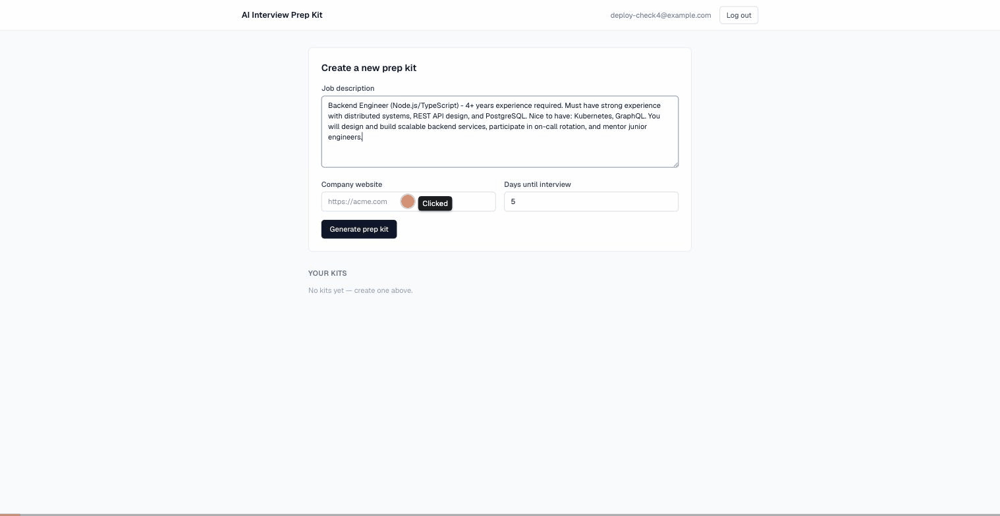
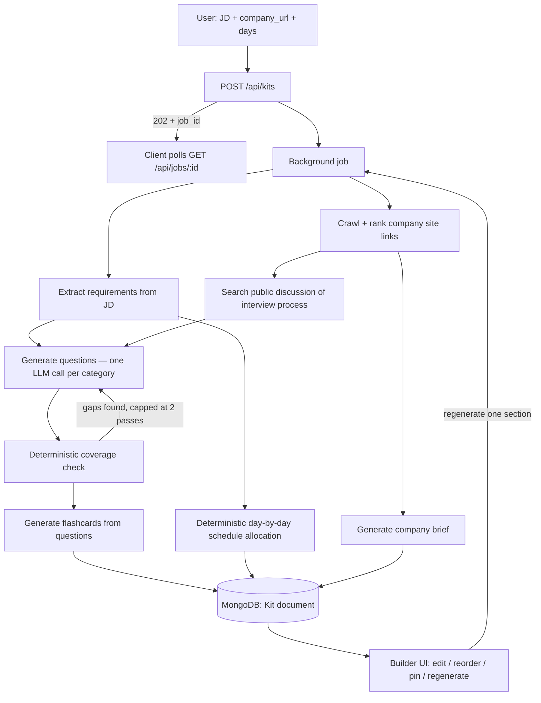

# The AI Interview Prep Kit

Paste a job description, a company URL, and days-until-interview. The app researches the
company (crawling its own site and searching for public discussion of its interview process),
deterministically extracts must/nice-have requirements from the JD, generates a categorised
question bank and flashcards through a multi-step LLM pipeline, runs a deterministic coverage
check to close gaps, allocates a day-by-day study schedule, and lets you edit, reorder, pin, or
regenerate any part without losing your edits elsewhere.

Built for the Trao Full-Stack Engineering Assessment.

**Live deployment:**
- App: https://interview-kit-phi.vercel.app
- API: https://interview-kit-o70r.onrender.com



*(Silent screen-capture walkthrough — see [docs/VIDEO_SCRIPT.md](docs/VIDEO_SCRIPT.md) for the narrated submission video script.)*

> The backend runs on Render's free tier, which spins down after inactivity — the first request
> after idle time can take 30–50s to wake it up. This is a known, documented tradeoff of the
> free-tier hosting choice (see [Design tradeoffs](#design-tradeoffs--known-limitations)), not a bug.

## Contents

- [Tech stack](#tech-stack)
- [Architecture](#architecture)
- [Setup](#setup)
- [Running tests](#running-tests)
- [The batch CLI](#the-batch-cli-npm-run-evaluate)
- [How research works](#how-research-works)
- [How the question pipeline works](#how-the-question-pipeline-works-the-multi-step-part)
- [How the coverage loop works](#how-the-coverage-loop-works)
- [How the schedule is allocated](#how-the-schedule-is-allocated)
- [The Builder: non-destructive regeneration](#the-builder-non-destructive-regeneration)
- [Security](#security)
- [Design tradeoffs & known limitations](#design-tradeoffs--known-limitations)

## Tech stack

| Layer | Choice | Why |
|---|---|---|
| Frontend | Next.js 16 (App Router) + Tailwind CSS 4 | Server-rendered auth pages, client-heavy Builder UI, one framework for both |
| Backend | Node.js + Express | Long-running background jobs (generation takes 60–120s) need a persistent process, not serverless functions |
| Database | MongoDB (Atlas, free M0 tier) | Kit documents are naturally nested/heterogeneous (questions, flashcards, schedule, coverage) — a good fit for a document store |
| Language | TypeScript everywhere | One shared zod schema (`shared/`) is the single source of truth for the exact Appendix A/B shapes, imported by backend, frontend, and the batch CLI |
| LLM | Google Gemini (`gemini-3.5-flash-lite`), Anthropic Claude fully wired as a fallback | See [below](#why-gemini-not-claude) |
| Public-discussion search | DuckDuckGo HTML scrape | No API key required, keeps the whole stack on free tiers |
| Backend host | Render (free) | Persistent Node process — Vercel's serverless execution-time caps are hostile to a 90s+ pipeline |
| Frontend host | Vercel (free) | Best-in-class Next.js hosting |

### Why Gemini, not Claude?

The original plan (see `.claude/rfcs/RFC-001-ai-interview-prep-kit/rfc.md`) was Anthropic Claude
Sonnet. Mid-build, the Anthropic account's credit balance hit zero (a real account-state issue,
confirmed via a live API call, not a code bug). The pipeline was built adapter-first — an
`LlmAdapter` interface with `ClaudeAdapter` and `GeminiAdapter` implementations selected via
`LLM_PROVIDER` env var — so switching providers same-day was a low-risk, one-line config change.
`ClaudeAdapter` is still fully built, tested, and selectable via `LLM_PROVIDER=anthropic` whenever
credits are available. The specific model (`gemini-3.5-flash-lite`) was chosen after discovering
mid-build that `gemini-3.6-flash`'s free tier (5 requests/min, 20/day) is far too restrictive for
a pipeline that fires several LLM calls per kit — every "Flash Lite" variant checked gave 15 RPM /
500 RPD instead.

## Architecture



The entire flow above lives in one function — `buildKit(input, deps, onProgress)` in
`backend/src/pipeline/orchestrator.ts` — that knows nothing about Express, Mongo, or the CLI.
It's called identically by:
- the async Express route (`POST /api/kits` → 202 + `job_id`, since generation takes 60–120s and
  the client polls `GET /api/jobs/:id` for progress), and
- the mandatory batch CLI (`npm run evaluate`),

which is what satisfies the "same pipeline, not a parallel implementation" requirement — the code
path graded by the batch CLI is exactly the code path the web app runs.

### Repo layout

```
backend/    Express API, the pipeline/orchestration layer, the batch CLI, all LLM/search/fetch adapters
frontend/   Next.js app — auth, kit dashboard, the Builder UI, Practice Mode
shared/     Appendix A (kit) and Appendix B (batch case) schemas as zod — imported by all three above
fixtures/   A static fixture company site (acme/) used by tests and local dev, mirroring Appendix B's shape
```

## Setup

Requires Node 20+ and pnpm.

```bash
pnpm install
cp .env.example .env
```

Fill in `.env`:

| Variable | Required | Notes |
|---|---|---|
| `LLM_PROVIDER` | yes | `gemini` or `anthropic` |
| `GEMINI_API_KEY` / `GEMINI_MODEL` | if using Gemini | from [aistudio.google.com](https://aistudio.google.com) |
| `ANTHROPIC_API_KEY` / `ANTHROPIC_MODEL` | if using Anthropic | |
| `MONGODB_URI` | yes | a free Atlas M0 cluster works fine |
| `SESSION_SECRET` | yes | any random string |
| `NODE_ENV` | no | `development` locally; set to `production` in deployment (enables secure/`SameSite=None` cookies and blocks SSRF against private IPs) |
| `PORT` | no | backend port, default `4000` |
| `FRONTEND_ORIGIN` | yes | the frontend's origin — enforced by both CORS and the CSRF Origin/Referer check |
| `NEXT_PUBLIC_API_URL` (frontend build-time) | yes | the backend's origin |

```bash
pnpm run dev:backend    # backend/src/index.ts via tsx watch, http://localhost:4000
pnpm run dev:frontend    # Next.js dev server, http://localhost:3000
```

For local development against a realistic company site without hitting the live internet, start
the bundled fixture server (`pnpm --filter @interview-prep-kit/backend run fixture-server`,
serves `fixtures/acme/` at `http://localhost:8099/acme/`) and use that as the `company_url`.

## Running tests

```bash
pnpm run test   # runs every workspace's test suite (backend: 184 tests, vitest + supertest + mongodb-memory-server)
```

The backend suite uses `mongodb-memory-server` for real Mongo semantics without a live cluster,
`supertest` against a real Express app instance (not mocked routes), and fake `Llm`/`Search`/`Fetch`
adapters for deterministic, offline pipeline tests.

## The batch CLI (`npm run evaluate`)

```bash
npm run evaluate -- --input cases.json --output kits.json [--concurrency 2]
```

Reads a JSON array of `{ id, jd, company_url, days }` (Appendix B `CaseInput`), runs each through
the exact same `buildKit()` pipeline the web app uses, and writes a JSON array of
`{ id, status, kit, error }` results (Appendix B `CaseResult`) — `status: "failed"` is reserved for
a case that couldn't produce a structurally valid kit at all; a thin or gap-ridden kit is still
`"ok"`, per the assessment's own guidance on honest-but-incomplete output. Malformed input rows
(missing fields, bad JSON) are recorded as individually failed results rather than aborting the
whole run. Concurrency defaults to 2, to respect free-tier LLM rate limits — each kit already
fires several concurrent category calls internally.

## How research works

**Company crawl**: starts at `company_url`, fetches the homepage, extracts every same-site link,
and ranks them by hyphen-tokenized path matching against terms like `careers`, `how-we-hire`,
`engineering`, `blog` (weighted differently — a `/blog/how-we-hire` post ranks above a generic
`/blog/`), with a penalty for dated archive-segment paths (e.g. `/2019/03/`) that tend to be stale.
The top-ranked pages are fetched and fed to the LLM to produce the company brief. If the crawl
produces zero reachable pages, the brief is generated honestly from the URL/JD alone rather than
fabricated, and public-discussion search is skipped entirely (searching under a garbage fallback
company name was found, during testing, to surface irrelevant real results — worse than no
results).

**Public discussion search**: a DuckDuckGo HTML scrape (no API key) for `"<company>" interview
process`, feeding into the same company-fit / behavioural question generation step.

**SSRF defense**: every fetched URL (including every hop of every redirect) is DNS-resolved and
checked against private/loopback/link-local/metadata ranges — not a hostname string match, which
is bypassable — before the request is made. This is environment-aware: private ranges are blocked
in production, but permitted outside production so the local fixture server
(`http://localhost:8099/acme/`) still works in dev/tests.

## How the question pipeline works (the multi-step part)

Question generation is deliberately **not** one prompt. Each requirement kind maps to specific
question categories (`technical` → technical + system-design, `behavioural` → behavioural,
`domain` → company-fit), and each category gets its **own separate LLM call** with its own
system prompt tailored to that category's style — a system-design prompt asks for a design
problem grounded in the role's stack; a behavioural prompt asks for STAR-style scenario questions;
a company-fit prompt draws on the crawled brief and public discussion search results. This runs
concurrently across categories, then flashcards are generated afterward from the finalized
question set.

Every prompt wraps untrusted, externally-sourced content (the pasted JD, crawled page text,
search snippets) in explicit XML-style delimiters, with the system prompt stating up front that
content inside those tags is data to analyze, never an instruction to follow — the defense against
prompt injection via a crafted JD or a compromised/adversarial company page.

## How the coverage loop works

After the first generation pass, a deterministic (non-LLM) coverage checker cross-references every
`must`-priority requirement against the generated questions' `requirement_ids`. Any uncovered
requirement triggers a second, targeted generation pass asking specifically to cover the gaps —
capped at 2 total passes (an explicit RFC decision to bound cost/latency). Any requirements still
uncovered after the cap are reported honestly in the kit's `coverage.uncovered_requirement_ids`
field rather than silently dropped or fabricated around.

## How the schedule is allocated

Schedule allocation is **fully deterministic arithmetic, not an LLM call** — the RFC's explicit
design decision, since a schedule is a resource-allocation problem, not a generative one. Questions
are sorted by priority and difficulty, then distributed across the available days so that:
must-priority and harder material is front-loaded (in case the user runs out of time before the
last day), every must-priority requirement appears somewhere in the schedule, and both extremes
(a 1-day cram schedule that compresses everything, and a 60-day schedule that spans the full range
without silently capping) are handled without special-casing.

## The Builder: non-destructive regeneration

The hardest state problem in this build: regenerating one section (e.g. "regenerate all technical
questions") must never clobber a user's hand-edits or pins elsewhere in the kit — including within
the very category being regenerated.

Every question, flashcard, the company brief, and the schedule carries a `_meta` block:

```ts
_meta: {
  source: "generated" | "edited" | "user_added",
  pinned: boolean,
  order: number,
  generatedAt: string | null,
  editedAt: string | null,
  generationBatch: string | null,
}
```

The merge rule on regenerate is simply: **keep an item if `source !== "generated"` or `pinned`
is true; discard and replace everything else.** Array sections (questions, flashcards) merge —
new generated items are appended alongside whatever survived. Single-object sections (company
brief, schedule) are fully replaced, since the user explicitly asked to regenerate exactly that
object and there's no equivalent per-item edit state to preserve within it.

A second, related problem: two regenerate requests for the same kit firing close together (a
double-click, or two open tabs) could otherwise race — both load the same document, both mutate
their own in-memory copy, and whichever saves last silently overwrites the other's work. The
regenerate endpoint checks for an already-`running` `Job` on the kit and returns `409
GENERATION_IN_PROGRESS` rather than allowing that race.

## Security

- **SSRF**: DNS-resolve-then-check on every fetch and every redirect hop (see above), not
  hostname-string matching.
- **Prompt injection**: every untrusted block (JD, crawled pages, search snippets) is delimiter-wrapped
  and named as data-only in the system prompt; LLM output is always schema-validated, never
  rendered via `dangerouslySetInnerHTML` (React's default escaping is the backstop against a
  successfully-injected response containing HTML/script becoming stored XSS).
- **IDOR**: every kit-touching route goes through one `getOwnedKit(kitId, userId)` helper that
  bakes ownership into the query itself, rather than an unscoped lookup plus a separate
  after-the-fact check — the pattern can't be forgotten on a new endpoint. Cross-user access
  returns `404`, not `403`, so existence isn't leaked.
- **Malformed IDs**: route params are validated as well-formed ObjectIds before hitting Mongo, so
  a malformed `kit_id`/`job_id` returns a clean `404` instead of an unhandled Mongoose `CastError`
  surfacing as a raw `500`.
- **CSRF**: an explicit Origin/Referer check on every state-changing request, since cookies are
  `SameSite=None` in production (required for the frontend and backend to live on different
  origins/hosts).
- **Auth**: bcrypt-hashed passwords (never logged, never returned in any response), `HttpOnly` +
  `Secure` (in production) session cookies, generic "invalid credentials" on login failure (no
  user-enumeration).
- **Rate limiting**: an in-process sliding-window limiter on kit generation/regeneration
  (cost control against the LLM API) and on auth endpoints (brute-force defense).
- **Logging discipline**: application logs never contain full JD text, fetched page bodies, or
  API keys. The central error handler logs only `err.stack` for unclassified errors — not the raw
  error object — since some internal error classes carry extra properties derived from untrusted
  LLM/page content that a naive `console.error(err)` would print alongside the stack.
- **Validated input boundary**: every request body is zod-validated before it touches a Mongo
  query or the pipeline — including rejecting whitespace-only job descriptions rather than letting
  them reach the LLM.

## Design tradeoffs & known limitations

- **Render free tier cold starts.** The backend spins down after ~15 minutes of inactivity; the
  first request afterward can take 30–50s. Documented and accepted rather than paying for an
  always-on instance, per the assessment's "deployed publicly on free tiers" requirement.
- **The web UI's batch-upload feature was not built.** The assessment (Section 2) mentions
  uploading a file of multiple JD+company pairs through the web UI as an option. This is
  **separate from the mandatory `npm run evaluate` batch CLI**, which is fully built, tested, and
  reuses the identical pipeline — that requirement is met. The web-UI convenience feature on top of
  it was cut for time; a user who wants to process multiple postings today does so one at a time
  through the dashboard, or via the CLI.
- **Duplicate-submission detection is dedupe-key-based, not a unique DB index.** MongoDB partial
  indexes don't support `$ne` (only `$eq`/`$exists`/range comparisons), so the
  `dedupe_key`-uniqueness-excluding-failed-kits constraint couldn't be expressed as a partial
  unique index; it's enforced at the application layer instead (`findExistingKitByDedupeKey`),
  which is race-condition-tolerant enough for this use case but not as bulletproof as a DB-level
  constraint under true concurrent duplicate submissions.
- **Coverage loop is capped at 2 passes.** An explicit cost/latency tradeoff (RFC §10); any
  requirement still uncovered after 2 passes is reported honestly rather than pursued indefinitely.
